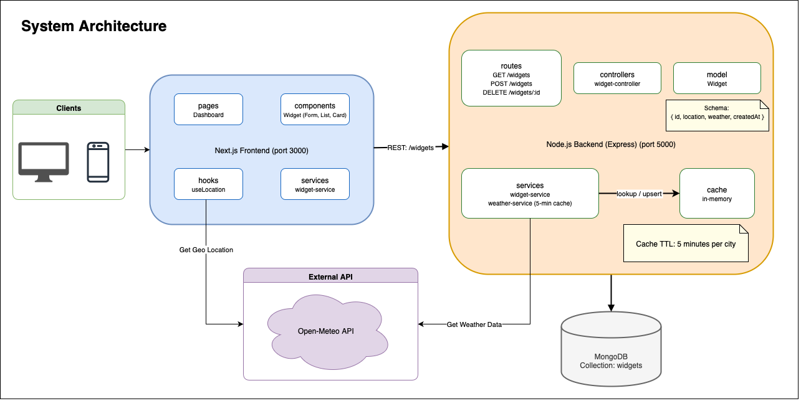

# 🌦️ Tecomon Widgets Dashboard


A full‑stack weather widget dashboard built with a **Next.js frontend and a Node.js (Express + TypeScript) + MongoDB backend**.

Users can add locations as _widgets_ and view current and daily weather, powered by the Open‑Meteo API.

It fetches weather data from the Open-Meteo API and caches responses for improved performance.

## 🚀 Features

- Search cities and create weather widgets
- View current temperature, day/night state, and 7-day forecast
- Persistent storage of widgets in MongoDB
- In-memory caching for external API requests
- Responsive UI with Next.js App Router

## 📦 Project Structure

```ini
Tecomon-Aufgabe/
├── weather-api/                          # Backend (Express + TypeScript)
│   ├── src/
│   │   ├── app.ts                        # Express app setup
│   │   ├── server.ts                     # Server bootstrap
│   │   ├── swagger.ts                    # Swagger UI setup
│   │   ├── docs/                         # API documentation
│   │   │   └── openapi.yaml              # OpenAPI 3.0 spec
│   │   ├── routes/                       # Express routes
│   │   │   ├── widget.route.ts           # /widgets endpoints
│   │   │   ├── health.routes.ts          # /health endpoint
│   │   │   └── index.ts
│   │   ├── controllers/                  # Controllers: handle HTTP requests
│   │   │   └── widget.controller.ts      # Validate input, call services, send responses
│   │   ├── services/                     # Services: core business logic
│   │   │   ├── widget.service.ts         # Widgets (DB + weather integration)
│   │   │   ├── weather.service.ts        # External weather API + caching
│   │   │   └── index.ts
│   │   ├── models/                       # Mongoose model
│   │   │   └── widget.model.ts
│   │   ├── interfaces/                   # TypeScript interfaces
│   │   │   ├── widget.interface.ts
│   │   │   ├── weather.interface.ts
│   │   │   └── index.ts
│   │   ├── types/                        # Custom TS types
│   │   │   ├── location.type.ts
│   │   │   ├── weather.type.ts
│   │   │   └── index.ts
│   │   ├── config/                       # Config for weather, DB, etc.
│   │   │   └── weather.config.ts
│   │   ├── mapper/                       # Mapping external API → internal model
│   │   │   ├── weather.mapper.ts
│   │   │   └── index.ts
│   │   ├── middleware/                   # Express middleware
│   │   │   └── error.middleware.ts       # Centralized error handling
│   │   └── lib/                          # Utility modules
│   │       ├── memory-cache.ts           # In-memory cache
│   │       ├── mongodb.ts                # DB connection
│   │       ├── error.ts                  # Error utilities
│   │       └── index.ts
│   ├── package.json
│   └── tsconfig.json
│
├── weather-app/                          # Frontend (Next.js + React)
│   ├── src/
│   │   ├── app/                          # Next.js App Router
│   │   │   ├── page.tsx                  # Root page
│   │   │   ├── layout.tsx                # Layout wrapper
│   │   │   ├── globals.css               # Global styles
│   │   │   └── not-found.tsx             # 404 page
│   │   ├── pages/
│   │   │   └── Dashboard.tsx             # Dashboard wrapper component
│   │   ├── components/                   # UI components
│   │   │   ├── widget/                   # Widget components (list, form, card)
│   │   │   ├── layout/                   # Header, Footer
│   │   │   ├── elements/                 # Buttons, dark mode toggle, dropdown
│   │   │   └── providers/                # ToastProvider
│   │   ├── hooks/                        # Custom React hooks
│   │   │   └── useLocation.tsx           # Location search (Open-Meteo geocoding)
│   │   ├── error/                        # Error utilities
│   │   │   └── HttpError.tsx
│   │   ├── services/                     # API service layer
│   │   │   ├── widget.service.tsx        # Calls backend /widgets endpoints
│   │   │   └── index.tsx
│   │   └── types/                        # TypeScript models
│   │       ├── widget.types.tsx
│   │       ├── weather.types.tsx
│   │       ├── locations.types.tsx
│   │       └── index.tsx
│   ├── public/                           # Static assets
│   ├── package.json
│   └── tsconfig.json
│
├── docs/                                # Documentation assets
│   └── architecture.png                 # Architecture diagram (for README)
│
├── TASK.md								 # Original README.md file describing the assignment task
└── README.md							 # Solution documentation
```

## 🛠️ Setup Guide

### 1. Prerequisites

- [Node.js](https://nodejs.org/) ≥ 18
- [MongoDB](https://www.mongodb.com/) running locally or in the cloud
- [npm](https://npmjs.com/) as package manager

### 2. Clone repository

```bash
git clone https://github.com/s-varun22/Tecomon-Aufgabe.git
cd Tecomon-Aufgabe
```

### 3. Backend (weather-api)

```bash
cd weather-api
cat > .env            # Configure your env variables
npm install
npm run build		  # Compiles TypeScript into JavaScript
npm run start         # Start the server
```

**Backend Environment variables**:

| Variable            | Description                   | Default                                    |
| ------------------- | ----------------------------- | ------------------------------------------ |
| `PORT`              | API server port               | 5000                                       |
| `MONGODB_URI`       | MongoDB connection string     | mongodb://localhost:27017/widgets          |
| `WEATHER_BASE_URL`  | External weather provider URL | https://api.open-meteo.com/v1/forecast     |
| `WEATHER_CACHE_TTL` | Cache TTL (ms)                | 300000                                     |
| `WEATHER_DAILY`     | Daily metrics requested       | temperature_2m_max,temperature_2m_min      |
| `WEATHER_CURRENT`   | Current metrics requested     | is_day,apparent_temperature,temperature_2m |
| `WEATHER_TIMEZONE`  | Timezone used for queries     | Europe/Berlin                              |

> Swagger UI → [http://localhost:5000/docs](http://localhost:5000/docs)  
> OpenAPI JSON → [http://localhost:5000/docs.json](http://localhost:5000/docs.json)

### 4. Frontend (weather-app)

```bash
cd ../weather-app
cat > .env            # Configure your env variables
npm install
npm run build		  # Build the Next.js app for production
npm run start         # Start the server
```

**Frontend Environment variables**:

| Variable                        | Description                       | Example                                        |
| ------------------------------- | --------------------------------- | ---------------------------------------------- |
| `NEXT_PUBLIC_API_BASE_URL`      | Backend widgets endpoint          | http://localhost:5000/widgets                  |
| `NEXT_PUBLIC_GEOCODING_API_URL` | Open-Meteo geocoding API endpoint | https://geocoding-api.open-meteo.com/v1/search |

### 5. Access the app

- Frontend: [http://localhost:3000](http://localhost:3000)

- API: [http://localhost:5000/health](http://localhost:5000/health) _(To check if the backed is up and running)_

## 🧾 API Description

Base URL: `http://localhost:5000`

| Method | Path            | Summary               |
| ------ | --------------- | --------------------- |
| GET    | `/widgets`      | Get all widgets       |
| POST   | `/widgets`      | Add a new widget      |
| DELETE | `/widgets/{id}` | Remove a widget by ID |
| GET    | `/health`       | Health check          |

### `GET /widgets`

List all saved widgets.

**Response**

```json
[
	{
		"id": "64fa...",
		"location": {
			"city": "Stuttgart",
			"state": "Baden-Wurttemberg",
			"country": "Germany",
			"latitude": 48.78232,
			"longitude": 9.17702
		},
		"weather": {
			"currentTemperature": 18,
			"unit": "°C",
			"isDay": true,
			"forecast": {
				"maximum": { "2025-08-25": 23, ... },
				"minimum": { "2025-08-25": 14, ... }
			}
		},
		"createdAt": "2025-08-27T22:19:28.499Z",
		"updatedAt": "2025-08-27T22:19:28.499Z"
	}
]
```

### `POST /widgets`

Create a new widget for a location.

**Request**

```json
{
	"location": {
		"city": "Stuttgart",
		"state": "Baden-Wurttemberg",
		"country": "Germany",
		"latitude": 48.78232,
		"longitude": 9.17702
	}
}
```

**Response**

```json
{
	"id": "64fa...",
	"location": { ... },
	"weather": { ... },
	"createdAt": "2025-08-27T22:19:28.499Z",
	"updatedAt": "2025-08-27T22:19:28.499Z"
}
```

### `DELETE /widgets/:id`

Delete a widget by ID.

```json
{
	"message": "Widget deleted successfully"
}
```

### `GET /health`

Simple health check if the service is up and running.

**Response**

```json
{
	"service": "Running"
}
```

## 🏛️ Architecture Overview



**Frontend**

- Next.js 15, App Router
- Components in `/src/components`
- API calls in `/services/widget.service.tsx`

**Backend**

- Express routes (`/src/routes/widget.route.ts`)
- Controllers → Services → Models
- Weather service fetches data from Open-Meteo and caches it (`memory-cache.ts`)
- MongoDB persistence via Mongoose

**External**

- MongoDB database
- Open-Meteo API

## 🌐 Data Flow

### Add Widget

1. User enters a location.
2. Frontend gets the Geo Location of the city and user selects from dropdown.
3. On Add Widget, the frontend calls **POST /widgets** with location details.
4. Backend fetches weather from cache, if not found then fetches from **Open‑Meteo**, caches it and returns enriched widget.
5. Backend inserts widget in MongoDB.
6. Frontend renders a **WidgetCard** with details.

### List Widgets

- Frontend → GET /widgets
- Backend → Query DB, resolve weather (cache if available), return list.

### Delete Widget

- Frontend → DELETE /widgets/{id}
- Backend → Removes record from MongoDB, returns status.

## ☁️ Weather Data API

The Open‑Meteo API offers a free, open-source weather service with no API key required for non-commercial use

- [Open-Meteo API](https://open-meteo.com/)

## 🧪 Developing & Testing

- Run backend (`weather-api`) and frontend (`weather-app`) in separate terminals
- Check API health at `GET /health`
- Use **Swagger** to explore endpoints (`/docs`)
- Frontend shows toast messages for API errors (`HttpError`)
- Both projects include ESLint/TypeScript configurations.

## 📚 References

- [Open-Meteo API](https://open-meteo.com/en/docs)
- [Express Docs](https://expressjs.com/)
- [Next.js Docs](https://nextjs.org/docs)
- [Swagger (OpenAPI)](https://swagger.io/specification/)

## 📄 License

This project is **private** assignment task for Interview.  
© 2025 Varun Srivastava. All rights reserved.

Unauthorized copying, modification, distribution, or use of this project,
in whole or in part, via any medium, is strictly prohibited without prior
written permission from the copyright holder.
